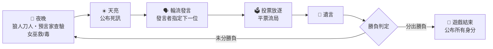

# 🐺 狼人殺 — 智慧 AI 補位多人連線版

網頁版狼人殺遊戲：後端以 **FastAPI + WebSocket** 驅動，AI 玩家由 **Google Gemini** 扮演。你可以一個人開局讓 AI 補滿全場、開房間和朋友連線同樂，或切到上帝模式旁觀一整桌 AI 互相演戲。人數不足自動 AI 補位，真人中途斷線也會由 AI 無縫接管，遊戲永遠不會卡死。

## 特色

- **三種玩法**
  - **單人模式**：1 位真人 + AI 補滿其餘座位，隨機分配身分。
  - **多人大廳**：建立房間取得 4 位房號，朋友輸入房號即可加入；房主開局後空位由 AI 補齊。
  - **上帝模式**：純 AI 對戰的旁觀視角，所有身分明牌（含狼人夜話），並可隨時暫停／繼續。
- **有個性的 AI 玩家**：每位 AI 隨機抽選 7 種發言人設之一（謹慎分析、直覺情緒派、質問挑釁、高冷沉穩、跟風牆頭草、激進帶風向、摸魚打太極），發言口語化、會互相點名與帶節奏。
- **完整狼人殺流程**：狼人刀人（含狼人頻道夜聊，AI 狼隊友會回話）、預言家查驗、女巫救人／下毒、白天輪流發言並指定下一位發言者、投票放逐（平票流局）、遺言、勝負判定。
- **穩定的 LLM 呼叫**：主用／備用雙模型自動切換，逾時、429 額度限流、500 伺服器錯誤皆有退避重試；JSON 回應解析容錯，發言過短時套用保底台詞，不會讓遊戲中斷。
- **斷線不斷局**：真人玩家斷線後由 AI 接管其座位並廣播系統訊息；房主離開時自動移交房主權限。
- **零建置前端**：原生 HTML／CSS／JavaScript，由後端直接供應靜態檔案，打開瀏覽器即玩；WebSocket 斷線每 3 秒自動重連。

## 角色與人數配置

支援 **6–12 人**（`backend/config.py` 的 `ROLE_DISTS` 可自訂）：

| 總人數 | 🐺 狼人 | 👤 村民 | 🔮 預言家 | 🧪 女巫 |
|:---:|:---:|:---:|:---:|:---:|
| 6  | 2 | 2 | 1 | 1 |
| 7  | 2 | 3 | 1 | 1 |
| 8  | 2 | 4 | 1 | 1 |
| 9  | 3 | 4 | 1 | 1 |
| 10 | 3 | 5 | 1 | 1 |
| 11 | 3 | 6 | 1 | 1 |
| 12 | 3 | 7 | 1 | 1 |

**勝負條件**：狼人全部出局 → 好人勝；狼人數量 ≥ 非狼存活數 → 狼人勝。

## 快速開始

### 環境需求

- Python 3.9 以上（建議 3.10+）
- Google Gemini API Key（可至 [Google AI Studio](https://aistudio.google.com/) 免費申請）

### 安裝

```bash
pip install -r backend/requirements.txt
```

### 設定 API Key

編輯 `backend/config.py`，將 `API_KEY` 換成你的 Gemini API Key：

```python
API_KEY = "你的 Gemini API Key"
```

> ⚠️ 金鑰以明碼寫在 `config.py` 中，若要公開或提交此專案，請先移除真實金鑰。

### 啟動

```bash
python backend/main.py
```

伺服器會在 `0.0.0.0:8765` 啟動並同時供應前端頁面，打開瀏覽器進入：

```
http://localhost:8765
```

### 與朋友連線同樂

伺服器綁定 `0.0.0.0`，同一區網的朋友直接用你的 IP 開啟 `http://<你的IP>:8765`，在「多人大廳」輸入 4 位房號即可加入。

> 注意：前端 WebSocket 連線埠寫死為 `8765`（`frontend/js/websocket.js`）。若修改後端埠號，需同步修改 `backend/main.py` 與 `frontend/js/websocket.js` 兩處。

## 遊戲流程



- **夜晚**：狼人選擇刀人目標，真人狼可在狼人頻道打字密聊，AI 狼隊友會即時回應；預言家查驗一名玩家身分；女巫得知刀人結果後決定用解藥或毒藥（各一瓶）。
- **白天發言**：首位發言者隨機產生，之後由每位發言者從尚未發言的玩家中指定下一位；未指定或指定無效時隨機遞補。
- **投票**：真人同時投票、AI 依序思考投票；得票最高者出局並發表遺言，平票則本輪無人出局。
- **操作逾時**：真人回合有 60 秒時限，逾時自動採用預設行動（跳過發言、隨機投票等），確保遊戲不停擺。

## 專案結構

```
wkb_fable/
├── backend/
│   ├── main.py            # FastAPI 入口：WebSocket 訊息路由、靜態檔案服務、斷線處理
│   ├── game.py            # 遊戲核心：大廳/房間管理、GameEngine 回合流程、AI 行動
│   ├── llm.py             # Gemini 呼叫封裝：雙模型備援、重試退避、Prompt 建構、回應解析
│   ├── config.py          # 設定：API Key、模型名稱、人數上下限、角色配置
│   └── requirements.txt   # Python 依賴
└── frontend/
    ├── index.html         # 單頁介面：大廳、房間等待室、遊戲畫面、結算彈窗
    ├── css/style.css      # 介面樣式
    └── js/
        ├── websocket.js   # GameSocket：連線管理、自動重連、訊息收發 API
        ├── game.js        # 遊戲畫面渲染與事件處理
        └── app.js         # 大廳/房間頁面邏輯
```

## 設定參考（`backend/config.py`）

| 設定 | 預設值 | 說明 |
|---|---|---|
| `API_KEY` | `"API"`（佔位） | Gemini API Key，**必須**換成自己的 |
| `PRIMARY_MODEL` | `gemma-4-26b-a4b-it` | 主用模型；追求速度可與備用模型互換（皆有免費額度） |
| `FALLBACK_MODEL` | `gemini-3.1-flash-lite` | 備用模型，速度較快，主用模型失敗時自動切換 |
| `LLM_TIMEOUT` | `60` | 單次 LLM 呼叫逾時秒數 |
| `LLM_MAX_RETRIES` | `5` | 每個模型的最大重試次數 |
| `MIN_PLAYERS` / `MAX_PLAYERS` | `6` / `12` | 開局人數上下限 |
| `ROLE_DISTS` | 見上表 | 各人數對應的角色配置 |
| `ROLE_NAMES` | — | 角色顯示名稱（含表情符號） |

## 技術架構

- **後端**：FastAPI + uvicorn。單一 WebSocket 端點 `/ws` 處理所有遊戲訊息，`/health` 供健康檢查，其餘路徑直接供應 `frontend/` 靜態檔案（含路徑穿越防護）。所有房間與對局狀態存於記憶體。
- **遊戲引擎**：`GameEngine` 以 asyncio 協程推進回合；真人行動透過 `asyncio.Future` 等待、AI 行動即時呼叫 LLM，兩者共用同一套流程，因此可任意混搭真人與 AI。
- **前端**：無框架、無建置步驟；`GameSocket` 統一封裝連線與訊息協定。

### WebSocket 訊息協定（節錄）

客戶端 → 伺服器：

| 類型 | 用途 |
|---|---|
| `start_game` | 單人／上帝模式直接開局（`player_count`、`mode`） |
| `create_room` / `join_room` / `start_room_game` | 建房、以房號加入、房主開局 |
| `get_room_list` | 取得等待中的公開房間列表 |
| `speak_and_next` | 發言並指定下一位發言者 |
| `vote` / `wolf_target` / `seer_target` / `witch_decision` / `last_words` | 各階段行動 |
| `wolf_chat` | 夜晚狼人頻道發話 |
| `pause` / `resume` | 暫停／繼續（房主或上帝模式） |

伺服器 → 客戶端（節錄）：`init`（開局身分與座位）、`phase`、`speech`、`ai_thinking`、`night_result`、`vote` / `vote_tie` / `elimination`、`wolf_message`、`your_turn` / `your_vote` 等行動提示、`room_list` / `room_joined` / `room_members_update` / `host_promoted`、`game_over`、`error`。

## 注意事項與已知限制

- 房間與對局狀態僅存在記憶體中，重啟伺服器即全部清空。
- 免費額度觸發限流（429）時會自動等待重試，AI 發言節奏可能因此變慢。
- 平票時直接流局進入夜晚，沒有 PK 加賽發言機制。
- 上帝模式為明牌旁觀，適合觀察 AI 行為與測試 Prompt 效果。
