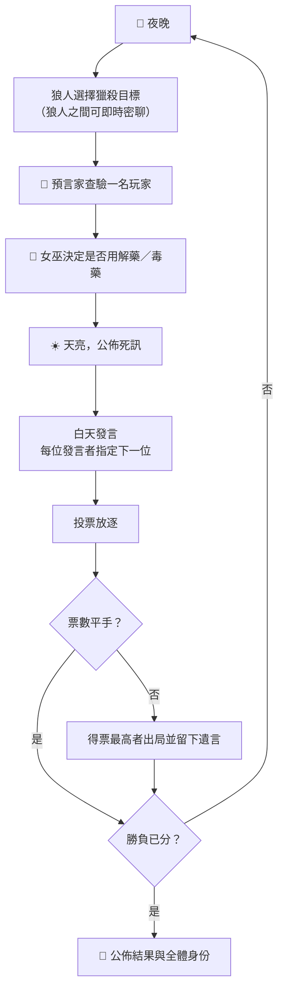

# 🐺 狼人殺 — 智慧 AI 補位多人連線版

以 Gemini 驅動 AI 玩家的線上狼人殺。人數不足時由 AI 自動補位，玩家中途斷線也會被 AI 無縫接管，因此**一個人也能開一局完整的 8 人局**。


- **AI 有個性，不像機器人** — 每位 AI 玩家開局隨機抽一種說話風格（謹慎分析、直覺派、質問型、高冷、跟風、激進、摸魚打太極），發言帶情緒與遊戲黑話，而不是死板的推理報告。
- **真人與 AI 同桌** — 同一局裡人類與 AI 混坐，身份隨機分配，沒人知道對面是誰。
- **斷線不卡局** — 玩家離線後該座位立即交給 AI 接手，遊戲繼續跑完。
- **上帝模式** — 純旁觀 AI 互鬥，所有身份公開，可隨時暫停／繼續觀察牌局。
- **零建置前端** — 原生 HTML/CSS/JS，由後端直接提供靜態檔案，不需 npm、不需打包。

---

## 目錄

- [快速開始](#快速開始)
- [遊玩模式](#遊玩模式)
- [遊戲規則](#遊戲規則)
- [專案結構](#專案結構)
- [設定說明](#設定說明)
- [API 參考](#api-參考)
- [AI 行為說明](#ai-行為說明)
- [疑難排解](#疑難排解)
- [已知限制](#已知限制)

---

## 快速開始

### 事前準備

- Python（建議 3.10 以上；`google-genai` 需要 3.9 以上）
- 一組 [Google Gemini API 金鑰](https://aistudio.google.com/apikey)（免費額度即可遊玩）

### 1. 安裝套件

```bash
pip install -r backend/requirements.txt
```

安裝內容：`fastapi`、`uvicorn`、`websockets`、`google-genai`、`pydantic`。

### 2. 填入 API 金鑰

打開 `backend/config.py`，把佔位字串 `"API"` 換成你自己的金鑰：

```python
API_KEY = "你的 Gemini API 金鑰"
```

> [!WARNING]
> `backend/config.py` **不在 `.gitignore` 內**，金鑰會以明文留在檔案裡。若你要把這個專案推上公開的 Git repo，請先把金鑰改成從環境變數讀取（例如 `os.environ["GEMINI_API_KEY"]`），或將 `config.py` 加進 `.gitignore`，避免金鑰外洩。

### 3. 啟動伺服器

```bash
python backend/main.py
```

伺服器會監聽 `0.0.0.0:8765`，前端與 WebSocket 共用同一個埠。啟動後開啟瀏覽器：

```
http://localhost:8765
```

確認服務正常：

```bash
curl http://localhost:8765/health
# {"status":"ok"}
```

### 4. 揪朋友一起玩（區域網路）

伺服器綁定 `0.0.0.0`，前端的 WebSocket 位址是依照瀏覽器網址列的主機名稱動態組出來的，所以同網段的朋友直接連你的內網 IP 即可，不需要改任何設定：

```
http://<你的區域網路 IP>:8765
```

> **要換埠號的話**：埠號寫死在兩個地方，必須同時修改 —
> `backend/main.py`（`uvicorn.run(...)` 的 `port`）與 `frontend/js/websocket.js`（`connect()` 內組出的 WebSocket URL）。

---

## 遊玩模式

| 模式 | 怎麼進入 | 說明 |
| --- | --- | --- |
| **單人模式** | 首頁「單人模式」分頁 → 選人數 → 開始遊戲 | 你 1 人上桌，其餘座位全部由 AI 補滿，立即開局。 |
| **多人大廳** | 首頁「多人大廳」分頁 | 建立房間會拿到一組 4 碼房號（例如 `W7KF`），朋友輸入房號即可加入；大廳也會列出目前所有等待中的房間。開局時人數不足的座位由 AI 補上。 |
| **上帝模式** | 兩種模式皆可勾選「👁️ 上帝模式」 | 你不參與遊戲，純旁觀 AI 對戰。所有玩家身份全程公開，狼人夜間密談也看得到，並提供 ⏸️ 暫停／▶️ 繼續控制。 |

房間規則：

- 支援 **6～12 人**局。
- 房號 4 碼、不分大小寫（輸入會自動轉大寫）。
- 房內暱稱不可重複，非上帝模式的房間人數上限即為設定的玩家人數。
- 只有房主能按下開始；房主離開時，房內第一位成員會自動遞補為新房主。
- 遊戲一旦開始，該房間就不再出現在大廳列表中。

---

## 遊戲規則

### 角色配置

依照玩家人數自動套用下列配置（定義於 `backend/config.py` 的 `ROLE_DISTS`）：

| 總人數 | 🐺 狼人 | 👤 村民 | 🔮 預言家 | 🧪 女巫 |
| :---: | :---: | :---: | :---: | :---: |
| 6 | 2 | 2 | 1 | 1 |
| 7 | 2 | 3 | 1 | 1 |
| 8 | 2 | 4 | 1 | 1 |
| 9 | 3 | 4 | 1 | 1 |
| 10 | 3 | 5 | 1 | 1 |
| 11 | 3 | 6 | 1 | 1 |
| 12 | 3 | 7 | 1 | 1 |

### 一個回合的流程



**發言順序**：白天由隨機一人先發言，之後每位發言者可以自行指定下一位（想回應誰、懷疑誰就點誰）。若指定無效或未指定，系統會從尚未發言者中隨機挑選。

**各角色能力**：

- 🐺 **狼人** — 每晚共同決定獵殺一人。多名狼人的選擇取眾數；夜間有專屬密聊頻道，真人發話時 AI 狼隊友會即時回話。
- 🔮 **預言家** — 每晚查驗一名尚未查驗過的玩家，得知其是否為狼人。查驗結果只有預言家本人（與旁觀者）看得到。
- 🧪 **女巫** — 擁有解藥與毒藥各一瓶，全局各限用一次。得知當晚被殺的對象後決定是否救人；**同一晚用了解藥就不能再下毒**。
- 👤 **村民** — 無特殊能力，靠發言與投票找出狼人。

### 勝負判定

- **好人陣營獲勝**：場上狼人全數出局。
- **狼人陣營獲勝**：存活狼人數 ≥ 存活非狼人數。

### 其他細節

- **投票平手**：當晚無人出局，直接進入下一夜。
- **遺言**：被票出局者可留下遺言，遺言會寫入發言歷史，之後 AI 的推理也會參考。
- **行動逾時**：真人玩家的每個行動有 **60 秒**時限，逾時將自動採用預設值（發言→「我還在觀察...」、投票→隨機、女巫→不用藥、預言家/狼人→交由系統決定）。

---

## 專案結構

```
.
├── backend/
│   ├── main.py           # FastAPI 進入點：WebSocket 路由、大廳訊息分派、靜態檔案服務
│   ├── game.py           # 核心：Player / Room / LobbyManager / GameEngine（日夜循環、投票、勝負）
│   ├── llm.py            # Gemini 呼叫封裝、各角色 prompt 組裝、JSON 容錯解析
│   ├── config.py         # API 金鑰、模型、人數上下限、角色配置表
│   └── requirements.txt
└── frontend/
    ├── index.html        # 三個頁面：設定/大廳、房間等待、遊戲桌
    ├── css/style.css
    └── js/
        ├── websocket.js  # GameSocket：連線、自動重連、所有訊息的送出方法
        ├── game.js       # 遊戲畫面渲染：玩家列表、聊天流、夜間行動面板
        └── app.js        # 大廳與頁面切換、按鈕事件綁定
```

後端沒有分層框架，`GameEngine.run()` 就是一個 `while` 迴圈：每回合依序 `await` 夜晚 → 白天 → 投票三個階段，真人玩家的行動用 `asyncio.Future` 掛起等待，AI 玩家的行動則直接 `await` Gemini 回應。所有畫面更新都靠 WebSocket 事件推播，前端沒有輪詢。

---

## 設定說明

`backend/config.py` 全部可調參數：

| 參數 | 預設值 | 說明 |
| --- | --- | --- |
| `API_KEY` | `"API"` | **必須修改**，填入你的 Gemini API 金鑰。 |
| `PRIMARY_MODEL` | `"gemma-4-26b-a4b-it"` | 主要使用的模型。 |
| `FALLBACK_MODEL` | `"gemini-3.1-flash-lite"` | 主模型重試耗盡後改用的備援模型（速度較快）。 |
| `LLM_TIMEOUT` | `60` | 單次模型呼叫逾時秒數。 |
| `LLM_MAX_RETRIES` | `5` | 每個模型的最大重試次數。 |
| `MIN_PLAYERS` / `MAX_PLAYERS` | `6` / `12` | 允許的玩家人數範圍。 |
| `ROLE_NAMES` | — | 角色代碼對應的顯示名稱與 emoji。 |
| `ROLE_DISTS` | — | 各人數的角色配置表，可自行增修陣營比例。 |

> 兩個模型名稱都可以自由替換成你的金鑰能存取的任何 Gemini／Gemma 模型。主用與備用可以對調 —— 若追求速度，把較快的模型放到 `PRIMARY_MODEL` 即可。

---

## API 參考

### HTTP

| 方法 | 路徑 | 說明 |
| --- | --- | --- |
| `GET` | `/health` | 健康檢查，回傳 `{"status": "ok"}`。 |
| `GET` | `/{path}` | 提供 `frontend/` 目錄下的靜態檔案；找不到檔案時回退到 `index.html`，並阻擋目錄跳脫（回 403）。 |

### WebSocket `/ws`

所有訊息皆為 JSON，並以 `type` 欄位區分。

**用戶端 → 伺服器**

| `type` | 附帶欄位 | 說明 |
| --- | --- | --- |
| `get_room_list` | — | 取得等待中的房間列表 |
| `create_room` | `player_name`, `player_count`, `mode` | 建立房間（`mode: "god"` 為上帝模式） |
| `join_room` | `room_id`, `player_name` | 以房號加入房間 |
| `start_game` | `player_count`, `mode` | 單人模式直接開局 |
| `start_room_game` | — | 房主開始遊戲 |
| `speak_and_next` | `text`, `next_speaker_id` | 白天發言並指定下一位發言者 |
| `vote` | `target_id` | 投票放逐 |
| `wolf_target` | `target_id` | 狼人指定夜間獵殺目標 |
| `wolf_chat` | `text` | 狼人夜間密聊 |
| `seer_target` | `target_id` | 預言家指定查驗對象 |
| `witch_decision` | `save`, `poison_target` | 女巫用藥決定 |
| `last_words` | `text` | 出局遺言 |
| `pause` / `resume` | — | 暫停／繼續遊戲（僅房主有效） |

**伺服器 → 用戶端**

| `type` | 說明 |
| --- | --- |
| `room_joined` / `room_members_update` / `room_list` / `host_promoted` | 大廳與房間狀態更新 |
| `init` | 開局資訊：你的 `player_id`、角色、玩家列表、角色配置 |
| `phase` | 階段切換（`night` / `day` / `voting`）與天數 |
| `your_turn` | 輪到你白天發言 |
| `your_vote`、`your_wolf_target`、`your_seer_target`、`your_witch_decision`、`your_last_words` | 輪到你執行對應行動 |
| `speech` / `last_words` | 某位玩家的發言或遺言 |
| `ai_thinking` | AI 正在思考（前端顯示動畫） |
| `vote` / `vote_tie` / `elimination` | 投票過程、平手結果、出局結算 |
| `night_result` | 天亮後公佈的死訊 |
| `seer_result` | 預言家查驗結果（僅送給預言家與旁觀者） |
| `wolf_message` | 狼人密聊訊息 |
| `message` | 系統廣播訊息 |
| `paused` | 遊戲已被房主暫停 |
| `game_over` | 遊戲結束並公開所有身份 |
| `error` | 錯誤提示文字 |

> 玩家列表在送出前會依「觀看者視角」過濾：一般玩家只看得到自己的身份、已死亡玩家的身份、狼隊友（若你是狼人）與已查驗對象（若你是預言家）；上帝模式與遊戲結束時才會全部公開。

---

## AI 行為說明

- **個性系統** — 每位玩家（含真人座位）在建立時隨機分配一種說話風格，這段人設會寫進 system prompt，讓 AI 的發言語氣彼此有明顯差異。
- **上下文** — AI 發言時會看到存活/死亡名單、最近的發言紀錄、已發言者清單，以及自己的角色專屬情報（狼隊友、查驗結果、昨晚死訊）。Prompt 明確禁止 AI 虛構「某人剛才沒發言」這類尚未發生的事。
- **重試與降級** — 呼叫模型時針對 `429`（額度超限）採遞增退避重試、`500`（伺服器錯誤）短暫重試；主模型重試耗盡後自動切換備援模型，全部失敗才回傳保底發言。
- **速率控制** — AI 發言前刻意加入約 1.5 秒延遲，一方面更像真人思考，一方面避免短時間送出過多請求觸發免費額度限制。
- **保底機制** — 模型回傳過短或空洞的發言（例如「嗯...」）時，會改用一組預先寫好的口語化備用台詞，避免場面冷掉。
- **斷線接管** — 玩家斷線時，其 WebSocket 會從 `player_connections` 移除，該座位後續行動自動走 AI 流程，並廣播「已由 AI 補位接管」的系統訊息。

---

## 疑難排解

| 症狀 | 可能原因與處理 |
| --- | --- |
| AI 都不說話，或發言全是「我還在思考...」 | `API_KEY` 未填或無效。確認 `backend/config.py` 已換成真實金鑰，並看終端機是否印出 `[Error]`。 |
| 終端機不斷出現 `[429 Quota]` | 觸發 Gemini 免費額度限制。程式會自動退避重試；若持續發生，請減少玩家人數、換用額度較寬鬆的模型，或稍後再玩。 |
| 終端機出現 `[Error] 所有模型都失敗` | `PRIMARY_MODEL` / `FALLBACK_MODEL` 的名稱你的金鑰無權存取。改成帳號可用的模型名稱。 |
| 頁面打得開但一直連不上、Console 顯示 WebSocket 錯誤 | 前端固定連 `8765` 埠。確認伺服器確實跑在 8765，或依[快速開始](#4-揪朋友一起玩區域網路)的說明同步修改兩處埠號。 |
| 朋友連不進區域網路的房間 | 檢查主機防火牆是否放行 8765 埠，並確認雙方在同一網段。 |
| 重開伺服器後房間全部消失 | 正常行為，房間與牌局只存在記憶體中（見[已知限制](#已知限制)）。 |

---

## 已知限制

- **狀態不持久** — 房間與進行中的牌局都存在記憶體，伺服器重啟即全部消失，也無法跨多個行程／實例水平擴充。
- **無身份驗證** — 任何能連到伺服器的人只要知道房號就能加入，暱稱是唯一的識別方式。
- **金鑰為明文** — 金鑰直接寫在 `backend/config.py`，尚未支援環境變數或 `.env` 讀取。
- **埠號寫死** — `8765` 同時寫在後端與前端，換埠需要改兩個檔案。
- **需要外網** — 每一次 AI 行動都會呼叫 Gemini API，離線環境無法遊玩，且遊戲節奏受 API 延遲影響。
- **未包含測試與授權條款** — 專案沒有測試套件，也沒有 `LICENSE` 檔案。
