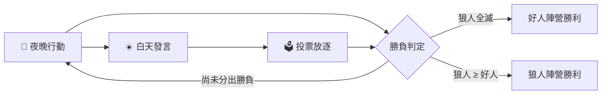

# 🐺 狼人殺 — 智慧 AI 補位多人連線版

一個可直接在瀏覽器中開局的狼人殺（Werewolf / Mafia 社交推理遊戲）連線版：一個人也能開局，缺少的座位會由 Google Gemini 驅動的 AI 玩家即時補上；也支援建立多人房間，讓朋友用房號一起連線同樂，中途斷線的座位還會無縫轉由 AI 接管。

> [!IMPORTANT]
> 遊戲中所有 AI 玩家（補位座位、以及上帝模式中的全部角色）都是即時呼叫 Google Gemini API 生成發言與決策。啟動前請先準備一組可用的 Gemini API 金鑰並填入 `backend/config.py`，否則 AI 的發言與技能判斷會全部退化為系統預設值或罐頭訊息（見〈[已知限制](#已知限制)〉）。

## 目錄

- [這是什麼](#這是什麼)
- [快速開始](#快速開始)
- [遊戲模式](#遊戲模式)
- [角色與勝負條件](#角色與勝負條件)
- [遊戲流程](#遊戲流程)
- [技術棧](#技術棧)
- [專案結構](#專案結構)
- [設定](#設定)
- [已知限制](#已知限制)
- [授權](#授權)

## 這是什麼

這是一個以 **Python（FastAPI + WebSocket）** 為後端、**純 HTML/CSS/JavaScript**（無建置流程）為前端的狼人殺遊戲。核心設計目標是「隨時都能開一局」：

- 一個人打開網頁就能開局，其餘 6～11 個座位由 AI 自動補滿。
- 也可以叫朋友一起玩：建立房間取得 4 碼房號，缺席的座位一樣由 AI 補上。
- 想單純看戲，可開啟「上帝模式」，讓全部座位都是 AI，並公開所有人的身分。

這是個人／展示規模的專案：沒有資料庫、沒有帳號系統、沒有自動化測試或 CI，狀態全部存在單一伺服器行程的記憶體中（詳見〈[已知限制](#已知限制)〉）。適合在自己的機器或內網上，找朋友一起玩一局狼人殺。

## 快速開始

**事前準備**

- Python 3（儲存庫未鎖定最低版本，以 `backend/requirements.txt` 的套件相容性為準）。
- 一組 Google Gemini API 金鑰（`google-genai` SDK 使用）。

**1. 安裝相依套件**

於專案根目錄執行：

```bash
pip install -r backend/requirements.txt
```

會安裝 `fastapi`、`uvicorn`、`websockets`、`google-genai`、`pydantic`（詳見 [`backend/requirements.txt`](backend/requirements.txt)）。

**2. 設定 Gemini API 金鑰**

編輯 [`backend/config.py`](backend/config.py)，將預留的佔位字串換成你自己的金鑰：

```python
API_KEY = "API"   # 換成你的 Gemini API 金鑰
```

**3. 啟動伺服器**

```bash
python backend/main.py
```

伺服器會在 `0.0.0.0:8765` 啟動，同一個連接埠同時提供靜態前端頁面與 `/ws` WebSocket 遊戲介面。

**4. 開啟遊戲**

瀏覽器開啟 `http://localhost:8765/`。也可以先用以下指令確認伺服器已啟動：

```bash
curl http://localhost:8765/health
# {"status":"ok"}
```

進入頁面後，於「單人模式」選擇玩家人數（6～12 人），按下「開始遊戲」即可立即開局；其餘座位會自動由 AI 補上。

## 遊戲模式

**單人模式**：選定人數（6～12）後立即開局，你會被隨機分配到其中一個座位與身分，其餘座位全部由 AI 扮演。勾選「上帝模式」則你只是旁觀者，所有座位都是 AI，且所有人的身分會直接公開，適合純看戲。

**多人大廳**：輸入暱稱後可以「建立房間」（取得 4 碼房號，可分享給朋友）或「加入房間」（輸入房號）。房間會等待房主按下「開始遊戲」；屆時仍未加入的座位一樣由 AI 補上。多人房間同樣可以建立為上帝模式，讓多位朋友一起旁觀同一場 AI 對戰。房主可在上帝模式的對局畫面中暫停／繼續。

若有真人玩家在對局中途斷線，伺服器會廣播系統訊息並讓 AI 無縫接管該座位，不會中斷遊戲；房間內若房主離線，會自動將房主權限轉移給下一位成員。

**AI 玩家**：每位 AI 玩家會被隨機賦予一種說話「人格」（例如謹慎分析型、直覺情緒型、質問挑釁型、沉穩高冷型、跟風附和型、激進帶風向型、隱藏摸魚型），讓每場對局中每個 AI 角色的語氣都不同。對 Gemini API 的呼叫內建逾時重試與主／備援模型自動切換（見〈[設定](#設定)〉），失敗時會回退為安全的預設行為，避免整場遊戲卡死。真人玩家在需要發言、投票或使用技能時，若 60 秒內未回應，系統也會套用預設行為（例如隨機投票、略過技能）以免遊戲卡住。

## 角色與勝負條件

| 角色 | 陣營 | 能力 |
| --- | --- | --- |
| 🐺 狼人 | 狼人陣營 | 每晚與同伴一起選定一位非狼人玩家淘汰；狼人之間有專屬的夜間悄悄話頻道 |
| 🔮 預言家 | 好人陣營 | 每晚可查驗一位尚未查過的存活玩家，得知其是否為狼人 |
| 🧪 女巫 | 好人陣營 | 手持一瓶解藥、一瓶毒藥（各限用一次）；每晚最多擇一使用：救回當晚的死者，或毒殺任一存活玩家 |
| 👤 村民 | 好人陣營 | 沒有主動技能，僅能透過白天發言與投票影響局勢 |

角色數量依玩家人數自動配置（來自 [`backend/config.py`](backend/config.py) 的 `ROLE_DISTS`）：

| 玩家人數 | 🐺 狼人 | 👤 村民 | 🔮 預言家 | 🧪 女巫 |
| :-: | :-: | :-: | :-: | :-: |
| 6 | 2 | 2 | 1 | 1 |
| 7 | 2 | 3 | 1 | 1 |
| 8 | 2 | 4 | 1 | 1 |
| 9 | 3 | 4 | 1 | 1 |
| 10 | 3 | 5 | 1 | 1 |
| 11 | 3 | 6 | 1 | 1 |
| 12 | 3 | 7 | 1 | 1 |

**勝負條件**：狼人全數出局時好人陣營獲勝；當存活狼人數量大於或等於存活好人數量時，狼人陣營獲勝。

## 遊戲流程

每一天由「夜晚 → 白天發言 → 投票」三階段循環，直到分出勝負：



- **夜晚**：狼人選定目標 → 預言家查驗一人 → 女巫決定是否救人／下毒 → 公布昨晚死亡結果。
- **白天發言**：存活玩家依序發言，每位發言者可指定下一位發言的對象（未指定或指定無效時隨機選下一位）。
- **投票**：存活玩家對懷疑對象投票，得票最多者出局並發表遺言；若最高票數的人不只一位則平票、當輪無人出局。

## 技術棧

| 分類 | 技術 |
| --- | --- |
| 後端 | Python、[FastAPI](https://fastapi.tiangolo.com/)、[Uvicorn](https://www.uvicorn.org/)（ASGI 伺服器）、WebSocket |
| AI | [Google Gen AI SDK](https://ai.google.dev/)（`google-genai`），呼叫 Gemini 系列模型 |
| 前端 | 原生 HTML5 / CSS3 / JavaScript（ES6 class），無框架、無建置工具，直接以 `<script>` 載入 |

## 專案結構

```text
.
├── backend/
│   ├── main.py           # FastAPI 應用：WebSocket /ws 端點、前端靜態檔案伺服、/health
│   ├── game.py           # Player / Room / LobbyManager / GameEngine：房間管理與核心遊戲規則
│   ├── llm.py            # Gemini prompt 建構與呼叫（含逾時重試、主／備援模型切換）
│   ├── config.py         # API 金鑰、模型名稱、人數上限、角色名稱與分配表
│   └── requirements.txt  # Python 相依套件
├── frontend/
│   ├── index.html        # 單頁式前端（大廳／房間等待／遊戲畫面／結算彈窗）
│   ├── css/style.css     # 版面與主題樣式
│   └── js/
│       ├── websocket.js  # GameSocket：WebSocket 連線與收發封裝
│       ├── game.js       # 遊戲畫面渲染、伺服器事件（speech / vote / night_result …）處理
│       └── app.js        # 大廳與房間頁面的 UI 互動邏輯
└── .gitignore
```

後端以單一 FastAPI 行程身兼兩職：以萬用路由（catch-all）伺服 `frontend/` 底下的靜態檔案，並在同一個連接埠上開放 `/ws` WebSocket 端點；大廳訊息（建立／加入房間、房間列表）與對局中的訊息（發言、投票、夜晚行動）共用同一條連線，由每則 JSON 訊息的 `type` 欄位區分。每個房間最多對應一個 `GameEngine`，以 `asyncio` 迴圈推進夜晚／白天／投票階段，並透過 `broadcast_event` 將狀態即時推送給所有連線中的成員；只要某個座位在 `player_connections` 中查無對應的 WebSocket（一開始就是 AI 座位，或真人斷線後被移除），該座位當下的行動就會自動轉為呼叫 Gemini 決定。

## 設定

所有設定都在 [`backend/config.py`](backend/config.py) 中以純變數形式提供，需直接修改檔案（目前未實作 `.env` 或環境變數讀取機制）：

| 變數 | 說明 | 目前預設值 |
| --- | --- | --- |
| `API_KEY` | Gemini API 金鑰 | `"API"`（佔位字串，必須換成實際金鑰） |
| `PRIMARY_MODEL` | 主要使用的 Gemini 模型 | `"gemma-4-26b-a4b-it"` |
| `FALLBACK_MODEL` | 主模型逾時或失敗次數用盡後的備援模型 | `"gemini-3.1-flash-lite"` |
| `LLM_TIMEOUT` | 單次模型呼叫的逾時秒數 | `60` |
| `LLM_MAX_RETRIES` | 每個模型的最大重試次數 | `5` |
| `MIN_PLAYERS` / `MAX_PLAYERS` | 遊戲人數上下限 | `6` / `12` |
| `ROLE_NAMES` | 角色顯示名稱與 Emoji | 狼人／村民／預言家／女巫 |
| `ROLE_DISTS` | 各人數對應的角色分配表 | 見〈[角色與勝負條件](#角色與勝負條件)〉 |

> [!WARNING]
> `backend/config.py` 填入真實金鑰後就是一份含有機密資訊的原始碼檔案，但 [`.gitignore`](.gitignore) 目前只排除了 `.env`、`__pycache__/` 與 `*.pyc`／`*.pyo`，**並未排除 `config.py`**。若要把這個專案推上共用或公開的版本庫，請自行將金鑰改存於環境變數，或把 `backend/config.py` 一併加入 `.gitignore`，以免金鑰外洩。

## 已知限制

- **無持久化**：房間與對局狀態全部存在記憶體（`LobbyManager` 的字典）中，重啟伺服器會清空所有進行中的房間與對局。
- **房號無驗證**：4 碼房號僅由大寫英數字隨機組成，沒有密碼保護；任何取得房號的人都可以在房間未滿、尚未開局前加入，不建議在不受信任的網路上公開部署。
- **連接埠寫死於前後端兩處**：`backend/main.py` 的 `uvicorn.run(..., port=8765)` 與 `frontend/js/websocket.js` 中組出的 WebSocket 網址都固定使用 `8765`；若要更換連接埠，兩處都要同步修改。
- **沒有自動化測試、CI 設定、Dockerfile 或 LICENSE 檔案**。
- **僅提供繁體中文介面與對話內容**，AI 的發言 prompt 也是以繁體中文口語風格設計，未做多語系支援。
- **依賴 Google Gemini API 的可用性與配額**：`backend/llm.py` 已內建逾時重試與模型備援，但配額超限或網路異常時，AI 玩家的發言與決策仍可能退化為罐頭訊息或隨機預設行為。

## 授權

此專案目前未包含 LICENSE 檔案。

TODO: 如需開放給他人使用或再散布，建議由專案作者補上明確的授權條款（例如 [MIT](https://spdx.org/licenses/MIT.html)、[Apache-2.0](https://spdx.org/licenses/Apache-2.0.html)），在此之前預設僅保留著作權人所有權利。
