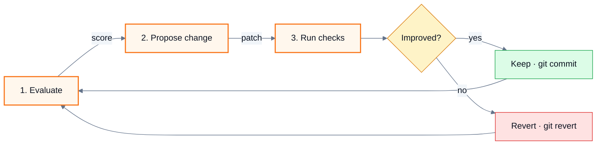

# Showcase README

Two presentation levels exist. **Plain** is the default: text, tables, code blocks, and the badges or images the user picked. **Showcase** turns the same facts into a designed page — a header block with a poster-style banner and a facts line, themed diagrams, feature cards, and collapsed reference tables — in the style of highly visual open-source pages. Read this file only when the user chose showcase at the step 3 checkpoint; never apply it on your own initiative.

Everything else in [readme-framework](readme-framework.md) still holds. Showcase changes how facts are presented, not which facts exist: every node in a diagram, every fact in the banner, every card in the grid is a component, command, number, or step the evidence inventory recorded; the license stays in the LICENSE file with no badge or section; no image or diagram carries the only copy of a fact, because renderers outside GitHub (npm, PyPI, crates.io, editor previews) may show nothing in its place.

The bar for every element below: **it must be recognisably this project's.** A banner, card grid, or diagram that would fit any repository unchanged is a template, not a design — give it the project's colour, its shapes, its numbers.

## Style proposal

The style is derived from the project and then chosen by the user — never guessed silently, never asked as an open question. Before the step 3 checkpoint, read three things off the repository and turn them into a proposal:

| Dimension | Read it from | Proposal |
| --- | --- | --- |
| Accent | Logo, existing assets, a site's CSS, a favicon; failing those, the palette rule below | The brand colour, or the rule's pick with the reason ("emerald, since the stack's own colours are purple and blue") |
| Mood | The existing README, docs site, or screenshots: dark terminal-style projects and CLIs read as dark posters; design-system, education, and documentation-heavy projects read as light editorial | Dark poster by default; light editorial when the evidence leans that way |
| Motif | The concept the first diagram shows | One of the four motifs, named with the real labels it would carry |

Put the proposal and one alternative to the user in the same checkpoint message as the other presentation questions ("dark poster, emerald accent, stacked-tiers motif — or light editorial with the same accent"), and take whatever they answer, including a colour or mood of their own. After drafting, the render check produces a PNG; attach it to the delivery so the user judges the banner as an image, not as SVG source.

## Palette

Choose once, reuse everywhere — banner, diagrams, cards:

- **Accent**: the project's existing brand colour when its assets, site, or logo have one. Otherwise pick one of `#f97316` (orange), `#10b981` (emerald), `#0ea5e9` (sky), `#8b5cf6` (violet) — whichever is furthest from the colours of the technologies the README names, so the accent reads as the project rather than as a framework logo.
- **Ground**, by mood. Dark poster: `#0f0f0f` ground, `#ffffff` wordmark, `#c8c8c8` body, `#7a7a7a` captions, `#2a2a2a` rules, motif greys `#3d3d3d` → `#242424`. Light editorial: `#fafafa` ground, `#111111` wordmark, `#444444` body, `#8a8a8a` captions, `#e0e0e0` rules, motif greys `#c4c4c4` → `#e6e6e6`. One accent on a flat ground is the whole scheme; gradients, grids, and a second hue make it a dashboard, not a poster.
- **Theme adaptation** is opt-in: the fixed ground already reads the same in GitHub's light and dark modes. When the user wants the banner to follow the viewer's theme, write both moods as two SVG files and reference them with `<picture>` and `prefers-color-scheme` sources — the mechanism GitHub documents — rather than a media query inside one SVG, which some renderers ignore.
- **Animation** is out: a README banner is read, not watched, and a moving banner says nothing a static one does not.
- **Diagrams** render on GitHub's light and dark backgrounds alike, so node fills are light tints of the accent with dark text (`#0b1220`) and the accent as border; never white text on a light fill or dark text on the ground colour.

## The header block

The first screen becomes a centered block. Include only the lines whose input exists:

````markdown
<div align="right">

**[English](README.md)** | [繁體中文](README.zh-TW.md)

</div>


<p align="center">
  " />
</p>

<div align="center">

# <Project name>

**<The tagline the user chose.>**

<One sentence of context: who it is for, or what it replaces.>

**Windows · macOS · Linux** &nbsp;·&nbsp; **18 tools** &nbsp;·&nbsp; **100% local, no network**

[](https://www.npmjs.com/package/<package>)
[](https://github.com/<owner>/<repo>/actions/workflows/ci.yml)

```bash
<the one install or run command the user chose as the primary path>
```

</div>

---
````

Rules for the block:

- The language switch line appears only when translated variants exist, and it appears in every variant.
- The hero `` uses a demo, screenshot, or animation that already exists in the repository. This skill does not produce raster images or animations; when none exists, drop the `<p>` and list "hero image or demo animation" as a recommendation in the delivery report.
- The **facts line** carries three to five numbers or nouns a reader uses to decide fit — platforms, tool or command count, package size, "no network", supported versions — each traced to a manifest, a directory listing, or code. A count is computed from the repository at writing time and recorded in the report as `counted from <path>`.
- Badges follow the badge rules and the user's answer at the checkpoint; a showcase README with zero badges is valid.
- Leave a blank line after every opening HTML tag and before every closing one, or GitHub will not render the Markdown inside it.
- The install command is the primary path the user chose; the full Getting Started section still follows later.

## The banner

When the repository has no banner, write one as an SVG so the user can replace it later with their own artwork. Put it where the repository already keeps images (`assets/`, `docs/images/`, `.github/`); create `assets/` only when no such directory exists. List the file under **Documents** in the delivery report as created.

The banner is a **poster, not a dashboard**: a flat dark ground, one accent, a typographic hierarchy that runs from a small uppercase eyebrow to a heavy display wordmark, and a single data motif on the right. Rounded pills, gradients, grid overlays, and boxes with text inside are the marks of a UI mockup; leave them out.

### Design floor

A banner ships with all six of these, or it is not finished:

1. **Eyebrow**: one uppercase line, letter-spaced, in the accent, naming the category the project belongs to (`MCP SERVER FOR RIMWORLD MODDING`, `CLI FOR POSTGRES MIGRATIONS`).
2. **Wordmark**: the project name at the largest size that fits the text column, weight 900, tight letter-spacing. It is the heaviest thing on the banner.
3. **Tagline**: the one the user chose, in one line under the wordmark.
4. **Flow line**: the core call or command sequence in monospace, three or four steps joined by accent-coloured arrows (`init → build → deploy`). A project with no sequence uses three nouns for what it does instead.
5. **Caption**: one uppercase letter-spaced line of three facts in grey — platforms, count, guarantee — each traced to the repository.
6. **Motif**: a data figure on the right, chosen from the table below and drawn for this project, with its own eyebrow above and caption beneath.

### Composition

There is no template to fill in. Compose the banner for this project, inside a `viewBox="0 0 1200 400"`, from these proportions:

- Margins of at least 80 units on every side; the design breathes or it looks cramped at README width.
- The text stack owns the left three fifths, the motif the right quarter, separated by a hairline divider or by empty space — one or the other, never a box around the motif.
- Reading order top to bottom in the text stack: eyebrow, wordmark, tagline, flow line, caption. Vertical spacing grows with the size of the element above it: the wordmark gets the most air, the caption the least.
- A thin accent rule runs along the left of the text stack, the only decorative element on the banner.
- The wordmark's size follows from the name's length (the fitting rules below); a short name goes huge, a long name goes as large as the column allows. The tagline is never more than a third of the wordmark's size.
- Left-align everything in the text stack; centre nothing.

The check for a finished composition: swap in another project's name, tagline, and facts, and the banner should look wrong — the motif's shapes, labels, and proportions belong to this project's concept and numbers.

### Fitting text

Widths below were measured in Chrome with Segoe UI; they hold within a few percent for the other system fonts. With `W` the text column's width (about 680 units when the motif takes the right quarter), compute every size before writing, because an overflowing wordmark or tagline is the most common way a banner fails:

| Text | Per-character width | Rule |
| --- | --- | --- |
| Wordmark, weight 900 | 0.58 × font-size | `font-size = min(110, floor(W / (0.58 × chars)))` — with `W` 680, 16 characters gives 70 and 8 gives 110 |
| Tagline, regular | 0.48 × font-size | `font-size = min(24, floor(W / (0.48 × chars)))`; below 18, wrap to a second line or ask the user for a shorter tagline |
| Flow line, monospace bold 20 | 12 per character + 32 per arrow | Total ≤ `W`; otherwise drop to 18 or cut to three steps |
| Eyebrow and caption, 14 with `letter-spacing` 3–4 | 0.65 × font-size + letter-spacing | ≤ 60 characters |
| Motif labels, 14 | 0.5 × font-size | A label inside a shape fits with 16 units to spare on each side, or it moves beneath the shape |

### Motifs

The motif is a figure, not decoration: it shows one ordered fact about the project — tiers, steps, or measured quantities — in shapes of grey that ramp toward the accent. Draw it from the concept, the way a chart is drawn from its data: decide what the shapes stand for, size them by the values or the order, then place the labels.

| Motif | Draw it when | Shape |
| --- | --- | --- |
| Stacked tiers | The first diagram shows layers, tiers, or a cache hierarchy | Three or four full-width bars, the first in the accent, the rest in greys darkening downward; each bar carries its name left and its cost right |
| Bar ramp | The repository records measured numbers in order — build times, scores, sizes — in docs, CI output, or benchmarks | Four bars rising left to right from grey to the accent, the value above each, a dashed accent trend line from bar top to bar top |
| Step chain | The project is a pipeline or a loop | Four small squares joined by accent arrows, the last square filled in the accent; a curved return arrow when it loops |
| Node pair | The project is a client and a server, or a bridge between two things | Two outlined boxes with the real names, a labelled arrow each way |

Numbers in a motif come from the evidence inventory and are recorded in the report with their source; a bar ramp without recorded numbers is the wrong motif — use stacked tiers or a step chain.

### Constraints that keep the banner rendering everywhere

- Text in the banner is limited to the eyebrow, the project name, the tagline, the flow line, the caption, and the motif labels. No slogans, statistics, or claims that are not already in the README.
- A fixed `viewBox="0 0 1200 400"` and no `width`/`height` attributes, so it scales with the page.
- A `font-family` stack of system fonts. No `@import`, no `<image href>`, no external URL of any kind: GitHub serves SVGs through a proxy that blocks outbound requests, so an imported font fails silently and the text falls back anyway.
- A fixed ground so the banner reads the same in light and dark themes.
- For a project with translated variants, one banner in the base README's language unless the user asks for one per variant.

### Render check

After writing the SVG, look at it before delivering. Wrap it in a page and screenshot it headlessly — Chrome and Edge both take `--headless=new --disable-gpu --hide-scrollbars --window-size=1200,400 --screenshot=<out.png> <file.html>` — or open it in the browser preview when the host provides one, and read the image. Check that no text crosses the divider or the right margin, the wordmark is the heaviest element, and the motif labels sit inside their bars. Fix and render again until it passes; two or three rounds are normal. When no renderer is available, verify every line against the fitting table by arithmetic and say so in the report under **Unrun checks**.

## One diagram per concept

Each major concept section — how the tool works, how the components fit, what the lifecycle is — opens with a Mermaid diagram followed by prose that states the same facts. GitHub renders Mermaid natively, the diagram lives in the Markdown and diffs with it, and no image file is needed.

| Concept | Diagram | Shape |
| --- | --- | --- |
| Pipeline, loop, or workflow | `flowchart LR` | Numbered steps left to right; a decision as a diamond; a loop as an edge back to the start |
| Tiers, layers, or a timeline | `flowchart LR` with `subgraph` per tier | Left to right in the order they complete; the cost or duration in the subgraph title |
| Components and their boundaries | `flowchart TB` with `subgraph` | One subgraph per service, package, or layer; edges labelled with what flows |
| Request or message exchange | `sequenceDiagram` | One participant per real process; messages named after the actual call or event |
| Lifecycle or mode transitions | `stateDiagram-v2` | States named as the code names them |

### Theme every diagram

Open each diagram with an init directive carrying the palette, and give nodes a class by role, so every diagram on the page reads as one set and matches the banner:



- `primaryColor` is a light tint of the accent (`#fff7ed` for orange, `#ecfdf5` emerald, `#f0f9ff` sky, `#f5f3ff` violet); `primaryBorderColor` is the accent itself. Substitute both when the accent changes.
- Three or four `classDef` roles per page at most — for example step, gate, storage, external — reused across every diagram so the same colour means the same thing everywhere.
- For `sequenceDiagram`, set `actorBkg`, `actorBorder`, and `signalColor` in the same directive; for `stateDiagram-v2`, `primaryColor` and `primaryBorderColor` are enough.

### Richness floor

A diagram earns its place when it shows something the prose beside it cannot show as quickly. The floor: **at least four nodes, and at least one edge label or subgraph.** Three boxes in a row, or three boxes stacked, is a list wearing a diagram's clothes — either enrich it with what the evidence contains (what flows on each edge, which boundary each node sits in, the cost of each tier) or drop it and keep the table.

### Rules for every diagram

- Every node, participant, subgraph, and state maps to something recorded in the evidence inventory: a directory, module, service, command, CI job, or documented step. A box that exists only to balance the picture is invented content.
- Edges say what flows: a call name, a file type, a message, a token. A bare arrow between two named boxes is the minimum, not the norm.
- Eight nodes or fewer. When a concept needs more, it belongs in `ARCHITECTURE.md`, and the README diagram shows only the top level.
- Labels in the README's language; identifiers (`src/cli/`, `POST /jobs`) stay as written in code.
- The prose beside the diagram is complete on its own, so a renderer that drops the diagram still tells the reader the same thing.
- A chart or figure that already exists in the repository is used instead of a new diagram when it matches the current code; when it has drifted, report the drift and draw the Mermaid version.
- Designed infographics (rendered PNG charts) are outside what this skill produces; when the user wants them, list each as a recommendation with the concept it would illustrate.

## Feature cards

The Highlights or Features section becomes a card grid instead of a bullet list. GitHub renders an HTML table; each cell is one card: a glyph, a bold title, one sentence. The title carries the meaning; the glyph is a visual anchor only, so the existing emoji rule holds.

```html
<table>
  <tr>
    <td align="center" width="33%">
      <h3>⚡ IL metadata index</h3>
      <sub>~100 k symbols in seconds, with full inheritance chains and real type signatures.</sub>
    </td>
    <td align="center" width="33%">
      <h3>🧪 Isolated test sessions</h3>
      <sub>Temporary save folder and linked mods; your real saves and settings are never touched.</sub>
    </td>
    <td align="center" width="33%">
      <h3>🔒 Local only</h3>
      <sub>No network calls; game files, indexes, and diagnostics stay on your machine.</sub>
    </td>
  </tr>
</table>
```

- Three columns on a page of six or nine features; two columns for four. A single leftover feature becomes prose under the grid, never a lone cell.
- One glyph per card, distinct across the grid; pick from a small set (⚡ speed, 🧪 testing, 🔒 security, 🧩 extensibility, 📦 packaging, 🔍 search, 🛠 build, 🌐 platforms) so the grid reads as a system rather than a sticker sheet.
- Every sentence is a fact the evidence inventory holds — a number, a mechanism, a guarantee — not an adjective.

## Collapsed reference

Long reference tables — a tool or command catalogue, environment variables, configuration keys — go inside `<details>`, with the count and the grouping in the summary so the page keeps its rhythm and a scanning reader still gets the number:

````markdown
<details>
<summary><b>18 tools in 4 groups</b> — research · installed mods · build · testing</summary>

### Researching the game

| Tool | Purpose |
| --- | --- |
| `rimworld_status` | Detected paths and index state. |
| … | … |

</details>
````

- The blank line after `<summary>` and before `</details>` is required, or the Markdown inside will not render.
- Collapse a table when it has more than eight rows or when there are two or more such tables in a row; a single short table stays open.
- Getting Started, configuration a reader must set, and security notes are never collapsed.

## Section rhythm

- Separate top-level sections with `---` so each concept reads as its own panel.
- Each panel opens with its visual — diagram, card grid, or collapsed summary — followed by prose; a panel that is only prose is fine when the concept has no shape, but two in a row means a diagram or grid was missed.
- At most one admonition per screen, reserved for the fact a reader must not miss; a page of callouts has none.
- Headings stay plain text. Emoji in headings only when the repository's existing documents already use them.
- The cognitive funnel is unchanged: the header block and the first diagram must still lead the reader to the smallest runnable example before any architecture.

## What showcase never does

- Adds a banner, hero, diagram, or card grid when the user chose plain, or did not answer.
- Draws a component, step, or flow the code does not contain, or puts a number in the banner or a card that was not counted from the repository.
- Replaces the Getting Started commands with a picture of them.
- Restores a license badge or License section.
- Imports fonts, scripts, or images from outside the repository into the banner.
