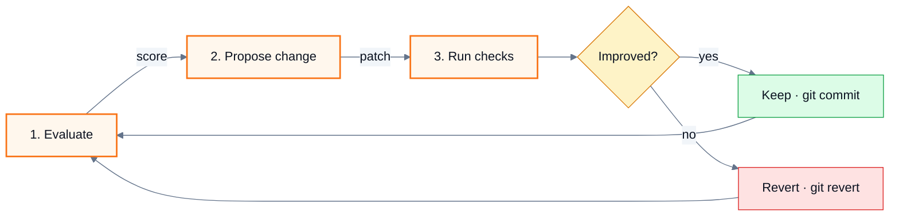

# Showcase README

Two presentation levels exist. **Plain** is the default: text, tables, code blocks, and the badges or images the user picked. **Showcase** turns the same facts into a designed page — a header block with a banner designed for the project and a facts line, one figure per concept (themed Mermaid or hand-drawn SVG), feature cards, and collapsed reference tables — in the style of highly visual open-source pages. Read this file only when the user chose showcase at the step 3 checkpoint; never apply it on your own initiative.

Everything else in [readme-framework](readme-framework.md) still holds. Showcase changes how facts are presented, not which facts exist: every node in a diagram, every fact in the banner, every card in the grid is a component, command, number, or step the evidence inventory recorded; the license stays in the LICENSE file with no badge or section; no image or diagram carries the only copy of a fact, because renderers outside GitHub (npm, PyPI, crates.io, editor previews) may show nothing in its place.

The bar for every element below: **it must be recognisably this project's.** A banner, card grid, or diagram that would fit any repository unchanged is a template, not a design — give it the project's colour, its shapes, its numbers.

## Style proposal

The style is derived from the project and then chosen by the user — never guessed silently, never asked as an open question. Before the step 3 checkpoint, read three things off the repository and turn them into a proposal:

| Dimension | Read it from | Proposal |
| --- | --- | --- |
| Accent | Logo, existing assets, a site's CSS, a favicon; failing those, the palette rule below | The brand colour, or the rule's pick with the reason ("emerald, since the stack's own colours are purple and blue") |
| Mood | The existing README, docs site, or screenshots: terminal-style projects and CLIs read dark; design-system, education, and documentation-heavy projects read light | Dark by default; light when the evidence leans that way |
| Direction | What the project is: a library, a CLI or server with a session, a pipeline or architecture, a project with a brand asset | One of the four banner directions below, with the figure or mockup it would carry named in the project's own terms |

Put the proposal and one alternative to the user in the same checkpoint message as the other presentation questions ("dark, emerald accent, terminal mockup of `rimworld_status` → `rebuild_index` — or figure-first with the three index tiers"), and take whatever they answer, including a colour or mood of their own. After drafting, the render check produces a PNG; attach it to the delivery so the user judges the banner as an image, not as SVG source.

## Palette

Choose once, reuse everywhere — banner, diagrams, cards:

- **Accent**: the project's existing brand colour when its assets, site, or logo have one. Otherwise pick one of `#f97316` (orange), `#10b981` (emerald), `#0ea5e9` (sky), `#8b5cf6` (violet) — whichever is furthest from the colours of the technologies the README names, so the accent reads as the project rather than as a framework logo.
- **Ground**, by mood. Dark: `#0f0f0f` ground, `#ffffff` wordmark, `#c8c8c8` body, `#7a7a7a` captions, `#2a2a2a` rules, motif greys `#3d3d3d` → `#242424`. Light editorial: `#fafafa` ground, `#111111` wordmark, `#444444` body, `#8a8a8a` captions, `#e0e0e0` rules, motif greys `#c4c4c4` → `#e6e6e6`. One accent and one ground are the scheme; a second hue only where it carries meaning (success, error, a second party in a diagram). Depth — a gradient ground, a glow behind a card, layered panels — is a taste decision for the direction chosen below, kept subtle enough that every text still passes contrast against what is directly behind it.
- **Theme adaptation** is opt-in: the fixed ground already reads the same in GitHub's light and dark modes. When the user wants the banner to follow the viewer's theme, write both moods as two SVG files and reference them with `<picture>` and `prefers-color-scheme` sources — the mechanism GitHub documents — rather than a media query inside one SVG, which some renderers ignore.
- **Animation** is out: a README banner is read, not watched, and a moving banner says nothing a static one does not.
- **Diagrams** render on GitHub's light and dark backgrounds alike, so node fills are light tints of the accent with dark text (`#0b1220`) and the accent as border; never white text on a light fill or dark text on the ground colour.

## The header block

The first screen becomes a centered block. Include only the lines whose input exists:

````markdown
<div align="right">

**[English](README.md)** | [繁體中文](README.zh-TW.md)

</div>


<p align="center">
  " />
</p>

<div align="center">

# <Project name>

**<The tagline the user chose.>**

<One sentence of context: who it is for, or what it replaces.>

**Windows · macOS · Linux** &nbsp;·&nbsp; **18 tools** &nbsp;·&nbsp; **100% local, no network**

[](https://www.npmjs.com/package/<package>)
[](https://github.com/<owner>/<repo>/actions/workflows/ci.yml)

```bash
<the one install or run command the user chose as the primary path>
```

</div>

---
````

Rules for the block:

- The language switch line appears only when translated variants exist, and it appears in every variant.
- The hero `` uses a demo, screenshot, or animation that already exists in the repository. This skill does not produce raster images or animations; when none exists, drop the `<p>` and list "hero image or demo animation" as a recommendation in the delivery report.
- The **facts line** carries three to five numbers or nouns a reader uses to decide fit — platforms, tool or command count, package size, "no network", supported versions — each traced to a manifest, a directory listing, or code. A count is computed from the repository at writing time and recorded in the report as `counted from <path>`.
- Badges follow the badge rules and the user's answer at the checkpoint; a showcase README with zero badges is valid.
- Leave a blank line after every opening HTML tag and before every closing one, or GitHub will not render the Markdown inside it.
- The install command is the primary path the user chose; the full Getting Started section still follows later.

## The banner

When the repository has no banner, write one as an SVG so the user can replace it later with their own artwork. Put it where the repository already keeps images (`assets/`, `docs/images/`, `.github/`); create `assets/` only when no such directory exists. List the file under **Documents** in the delivery report as created.

Design it the way a front-end designer would: choose a direction that fits what the project *is*, then compose for this project. This recipe fixes what must be true of the result and how to check it — not what it looks like. Two banners made with it for two different projects should not share a layout.

### Directions

| Direction | Fits | What carries the design |
| --- | --- | --- |
| Editorial poster | A library, a tool with one clear concept, a project with a strong name | Typographic hierarchy — a small letter-spaced eyebrow, the name as a heavy display wordmark, the tagline — with one figure of the core concept beside it |
| Product or terminal mockup | A CLI, a server, an agent tool: anything with a session a reader would recognise | A window or terminal card showing a real invocation and the text the program actually prints, with the name and tagline set beside it |
| Figure-first | A pipeline, an architecture, a protocol: anything whose shape *is* the pitch | The figure fills the banner — real stages, ports, limits, boundaries — and the wordmark sits in a corner of it |
| Split panel | A project with a brand colour or a logo asset in the repository | One panel in the brand colour carrying the mark, the other carrying name, tagline, and facts |

Pick by fit, not by habit; when two directions fit, the one that shows more of the project's own concept wins. Depth (gradient, glow, cards), flat, dark, or light are taste decisions inside the direction, made for the mood chosen at the checkpoint.

### What every banner carries

- The project name as the heaviest element on the canvas.
- The tagline the user chose.
- At least one figure, mockup, or fact set drawn from this project's own concepts — the thing that makes the swap test fail: swap in another project's name, tagline, and facts, and the banner should look wrong.
- Facts on the banner — counts, platforms, ports, limits, versions — traced to the repository and recorded in the report with their source. A count is computed from the repository at writing time (`counted from <path>`).

### What a mockup may show

A terminal or window card shows only what the program actually emits: commands that exist in the CLI or manifest, and output text that exists as a string in the source, in a test fixture, or was captured from a run the user authorised. Sample identifiers, sample error messages, and "typical" results the repository does not contain are invented content, and the credibility they cost outweighs any design they add. When the real output is dull, show the command alone with a cursor, or choose another direction.

### Fitting text

Widths below were measured in Chrome with Segoe UI; they hold within a few percent for the other system fonts. With `W` the width available to a line of text (the column it sits in, or the card it sits in), compute every size before writing, because an overflowing wordmark, tagline, or command line is the most common way a banner fails:

| Text | Per-character width | Rule |
| --- | --- | --- |
| Display wordmark, weight 800–900 | 0.58 × font-size | `font-size = min(110, floor(W / (0.58 × chars)))`; a name too long for 48 breaks at a hyphen or word boundary onto a second line |
| Body and tagline, regular | 0.48 × font-size | `font-size = min(24, floor(W / (0.48 × chars)))`; below 18, wrap to a second line or ask the user for a shorter tagline |
| Monospace (commands, output, flow lines) | 0.6 × font-size per character | Total ≤ `W` of the card or column it sits in, arrows and prompts included |
| Uppercase letter-spaced labels | 0.65 × font-size + letter-spacing | ≤ 60 characters |
| Labels inside a shape | 0.5 × font-size | Fits with 16 units to spare on each side, or it moves beneath the shape |

Nothing on the banner is set below 12 units; at README width the canvas renders at roughly 900 pixels, and smaller text is decoration that cannot be read.

### Constraints that keep the banner rendering everywhere

- Every string on the banner is the name, the tagline, a fact with a source, a real command or output line, or a label on a figure. No slogans, statistics, or claims that are not already in the README.
- A fixed `viewBox="0 0 1200 400"` and no `width`/`height` attributes, so it scales with the page.
- A `font-family` stack of system fonts. No `@import`, no `<image href>`, no external URL of any kind: GitHub serves SVGs through a proxy that blocks outbound requests, so an imported font fails silently and the text falls back anyway.
- A fixed ground so the banner reads the same in light and dark themes.
- For a project with translated variants, one banner in the base README's language unless the user asks for one per variant.

### Render check

After writing the SVG, look at it before delivering. Wrap it in a page and screenshot it headlessly — Chrome and Edge both take `--headless=new --disable-gpu --hide-scrollbars --window-size=1200,400 --screenshot=<out.png> <file.html>` — or open it in the browser preview when the host provides one, and read the image. Check that no text crosses the edge of its card, column, or the canvas; that the name is the heaviest element; that every label is legible; and that the composition is not mostly empty ground — a banner whose canvas is a quarter empty is unfinished. Fix and render again until it passes; two or three rounds are normal. When no renderer is available, verify every line against the fitting table by arithmetic and say so in the report under **Unrun checks**.

## One figure per concept

Each major concept section — how the tool works, how the components fit, what the lifecycle is — opens with a figure followed by prose that states the same facts. Two ways to draw one; a page may mix them under one palette:

| Way | Reach for it when | Cost and reach |
| --- | --- | --- |
| Mermaid in the Markdown | The concept is a flow, a sequence, or a state machine, and a themed default rendering says it well | Cheapest; diffs with the text; renders on GitHub and GitLab, not on npm, PyPI, or crates.io pages |
| Hand-drawn SVG in `assets/` | The concept deserves a designed panel — an architecture with boundaries and labelled flows, a tiered index with its costs, a request path across processes — in the banner's own palette | More work; same render check and fitting rules as the banner; renders everywhere an image does |

Either way the shape follows the concept:

| Concept | Shape |
| --- | --- |
| Pipeline, loop, or workflow | Steps left to right; a decision as a diamond; a loop as an edge back to the start |
| Tiers, layers, or a timeline | Left to right in the order they complete, each with its cost or duration |
| Components and their boundaries | One region per service, package, or layer; edges labelled with what flows |
| Request or message exchange | One lane per real process; messages named after the actual call or event |
| Lifecycle or mode transitions | States named as the code names them |

### Theme Mermaid to the palette

Open each Mermaid diagram with an init directive carrying the palette, and give nodes a class by role, so every diagram on the page reads as one set and matches the banner:



- `primaryColor` is a light tint of the accent (`#fff7ed` for orange, `#ecfdf5` emerald, `#f0f9ff` sky, `#f5f3ff` violet); `primaryBorderColor` is the accent itself. Substitute both when the accent changes.
- Three or four `classDef` roles per page at most — for example step, gate, storage, external — reused across every diagram so the same colour means the same thing everywhere.
- For `sequenceDiagram`, set `actorBkg`, `actorBorder`, and `signalColor` in the same directive; for `stateDiagram-v2`, `primaryColor` and `primaryBorderColor` are enough.

### Richness floor

A figure earns its place when it shows something the prose beside it cannot show as quickly. The floor: **at least four nodes, and at least one edge label or region.** Three boxes in a row, or three boxes stacked, is a list wearing a diagram's clothes — either enrich it with what the evidence contains (what flows on each edge, which boundary each node sits in, the cost of each tier) or drop it and keep the table.

### Rules for every figure

- Every node, lane, region, and state maps to something recorded in the evidence inventory: a directory, module, service, command, CI job, or documented step. A box that exists only to balance the picture is invented content.
- Edges say what flows: a call name, a file type, a message, a token. A bare arrow between two named boxes is the minimum, not the norm.
- Eight nodes or fewer. When a concept needs more, it belongs in `ARCHITECTURE.md`, and the README figure shows only the top level.
- Labels in the README's language; identifiers (`src/cli/`, `POST /jobs`) stay as written in code.
- The prose beside the figure is complete on its own, so a renderer that drops the figure still tells the reader the same thing.
- A chart or figure that already exists in the repository is used instead of a new one when it matches the current code; when it has drifted, report the drift and draw the current version.
- A hand-drawn SVG passes the banner's render check before delivery; raster images are not produced.

## Feature cards

The Highlights or Features section becomes a card grid instead of a bullet list. GitHub renders an HTML table; each cell is one card: a glyph, a bold title, one sentence. The title carries the meaning; the glyph is a visual anchor only, so the existing emoji rule holds.

```html
<table>
  <tr>
    <td align="center" width="33%">
      <h3>⚡ IL metadata index</h3>
      <sub>~100 k symbols in seconds, with full inheritance chains and real type signatures.</sub>
    </td>
    <td align="center" width="33%">
      <h3>🧪 Isolated test sessions</h3>
      <sub>Temporary save folder and linked mods; your real saves and settings are never touched.</sub>
    </td>
    <td align="center" width="33%">
      <h3>🔒 Local only</h3>
      <sub>No network calls; game files, indexes, and diagnostics stay on your machine.</sub>
    </td>
  </tr>
</table>
```

- Three columns on a page of six or nine features; two columns for four. A single leftover feature becomes prose under the grid, never a lone cell.
- One glyph per card, distinct across the grid; pick from a small set (⚡ speed, 🧪 testing, 🔒 security, 🧩 extensibility, 📦 packaging, 🔍 search, 🛠 build, 🌐 platforms) so the grid reads as a system rather than a sticker sheet.
- Every sentence is a fact the evidence inventory holds — a number, a mechanism, a guarantee — not an adjective.

## Collapsed reference

Long reference tables — a tool or command catalogue, environment variables, configuration keys — go inside `<details>`, with the count and the grouping in the summary so the page keeps its rhythm and a scanning reader still gets the number:

````markdown
<details>
<summary><b>18 tools in 4 groups</b> — research · installed mods · build · testing</summary>

### Researching the game

| Tool | Purpose |
| --- | --- |
| `rimworld_status` | Detected paths and index state. |
| … | … |

</details>
````

- The blank line after `<summary>` and before `</details>` is required, or the Markdown inside will not render.
- Collapse a table when it has more than eight rows or when there are two or more such tables in a row; a single short table stays open.
- Getting Started, configuration a reader must set, and security notes are never collapsed.

## Section rhythm

- Separate top-level sections with `---` so each concept reads as its own panel.
- Each panel opens with its visual — diagram, card grid, or collapsed summary — followed by prose; a panel that is only prose is fine when the concept has no shape, but two in a row means a diagram or grid was missed.
- At most one admonition per screen, reserved for the fact a reader must not miss; a page of callouts has none.
- Headings stay plain text. Emoji in headings only when the repository's existing documents already use them.
- The cognitive funnel is unchanged: the header block and the first diagram must still lead the reader to the smallest runnable example before any architecture.

## What showcase never does

- Adds a banner, hero, diagram, or card grid when the user chose plain, or did not answer.
- Draws a component, step, or flow the code does not contain, puts a number in the banner or a card that was not counted from the repository, or shows output in a mockup that the program does not print.
- Replaces the Getting Started commands with a picture of them.
- Restores a license badge or License section.
- Imports fonts, scripts, or images from outside the repository into the banner.
