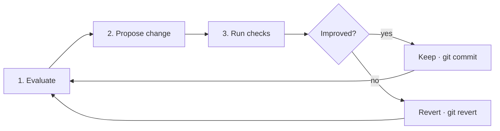

# Showcase README

Two presentation levels exist. **Plain** is the default: text, tables, code blocks, and the badges or images the user picked. **Showcase** adds a designed header block and one diagram per concept, in the style of highly visual open-source pages. Read this file only when the user chose showcase at the step 3 checkpoint; never apply it on your own initiative.

Everything else in [readme-framework](readme-framework.md) still holds. Showcase changes how facts are presented, not which facts exist: every node in a diagram is a component, command, or step the evidence inventory recorded; the license stays in the LICENSE file with no badge or section; no image or diagram carries the only copy of a fact, because renderers outside GitHub (npm, PyPI, crates.io, editor previews) may show nothing in its place.

## The header block

The first screen becomes a centered block. Include only the lines whose input exists:

````markdown
<div align="right">

**[English](README.md)** | [繁體中文](README.zh-TW.md)

</div>


<p align="center">
  " />
</p>

<div align="center">

# <Project name>

**<The tagline the user chose.>**

<One sentence of context: who it is for, or what it replaces.>

[](https://www.npmjs.com/package/<package>)
[](https://github.com/<owner>/<repo>/actions/workflows/ci.yml)

```bash
<the one install or run command the user chose as the primary path>
```

</div>

---
````

Rules for the block:

- The language switch line appears only when translated variants exist, and it appears in every variant.
- The hero `` uses a demo, screenshot, or animation that already exists in the repository. This skill does not produce raster images or animations; when none exists, drop the `<p>` and list "hero image or demo animation" as a recommendation in the delivery report.
- Badges follow the badge rules and the user's answer at the checkpoint; a showcase README with zero badges is valid.
- Leave a blank line after every opening HTML tag and before every closing one, or GitHub will not render the Markdown inside it.
- The install command is the primary path the user chose; the full Getting Started section still follows later.

## The banner

When the repository has no banner, write one as an SVG so the user can replace it later with their own artwork. Put it where the repository already keeps images (`assets/`, `docs/images/`, `.github/`); create `assets/` only when no such directory exists. List the file under **Documents** in the delivery report as created.

Constraints that keep the banner rendering everywhere:

- Text only: the project name and the tagline. No slogans, statistics, or claims that are not already in the README.
- A fixed `viewBox="0 0 1200 400"` and no `width`/`height` attributes, so it scales with the page.
- A `font-family` stack of system fonts. No `@import`, no `<image href>`, no external URL of any kind: GitHub serves SVGs through a proxy that blocks outbound requests, so an imported font fails silently and the text falls back anyway.
- Colours from the project's existing assets or site when they exist; otherwise the neutral pair below. A fixed background so the banner reads the same in light and dark themes.
- For a project with translated variants, one banner in the base README's language unless the user asks for one per variant.

Template:

```svg
<svg viewBox="0 0 1200 400" xmlns="http://www.w3.org/2000/svg" role="img" aria-labelledby="title">
  <title id="title">PROJECT_NAME — TAGLINE</title>
  <defs>
    <linearGradient id="bg" x1="0" y1="0" x2="1" y2="1">
      <stop offset="0%" stop-color="#111827"/>
      <stop offset="100%" stop-color="#1f2937"/>
    </linearGradient>
  </defs>
  <rect width="1200" height="400" rx="24" fill="url(#bg)"/>
  <text x="80" y="190" font-family="system-ui, -apple-system, 'Segoe UI', Roboto, sans-serif" font-size="72" font-weight="700" fill="#f9fafb">PROJECT_NAME</text>
  <text x="80" y="260" font-family="system-ui, -apple-system, 'Segoe UI', Roboto, sans-serif" font-size="30" fill="#9ca3af">TAGLINE</text>
</svg>
```

Adjust `font-size` so the longest line stays inside the 1200-unit width with an 80-unit margin on both sides; a tagline longer than about 55 characters wraps into a second `<text>` line 40 units lower.

## One diagram per concept

Each major concept section — how the tool works, how the components fit, what the lifecycle is — opens with a Mermaid diagram followed by prose that states the same facts. GitHub renders Mermaid natively, the diagram lives in the Markdown and diffs with it, and no image file is needed.

| Concept | Diagram | Shape |
| --- | --- | --- |
| Pipeline, loop, or workflow | `flowchart LR` | Numbered steps left to right; a decision as a diamond; a loop as an edge back to the start |
| Components and their boundaries | `flowchart TB` with `subgraph` | One subgraph per service, package, or layer; edges labelled with what flows |
| Request or message exchange | `sequenceDiagram` | One participant per real process; messages named after the actual call or event |
| Lifecycle or mode transitions | `stateDiagram-v2` | States named as the code names them |

Rules for every diagram:

- Every node, participant, and state maps to something recorded in the evidence inventory: a directory, module, service, command, CI job, or documented step. A box that exists only to balance the picture is invented content.
- Eight nodes or fewer. When a concept needs more, it belongs in `ARCHITECTURE.md`, and the README diagram shows only the top level.
- Labels in the README's language; identifiers (`src/cli/`, `POST /jobs`) stay as written in code.
- The prose beside the diagram is complete on its own, so a renderer that drops the diagram still tells the reader the same thing.
- A chart or figure that already exists in the repository is used instead of a new diagram when it matches the current code; when it has drifted, report the drift and draw the Mermaid version.
- Designed infographics (rendered PNG charts) are outside what this skill produces; when the user wants them, list each as a recommendation with the concept it would illustrate.

Example for a tool with an evaluate → change → verify loop:



## Section rhythm

- Separate top-level sections with `---` so each concept reads as its own panel.
- At most one admonition per screen, reserved for the fact a reader must not miss; a page of callouts has none.
- Headings stay plain text. Emoji in headings only when the repository's existing documents already use them.
- The cognitive funnel is unchanged: the header block and the first diagram must still lead the reader to the smallest runnable example before any architecture.

## What showcase never does

- Adds a banner, hero, or diagram when the user chose plain, or did not answer.
- Draws a component, step, or flow the code does not contain.
- Replaces the Getting Started commands with a picture of them.
- Restores a license badge or License section.
- Imports fonts, scripts, or images from outside the repository into the banner.
